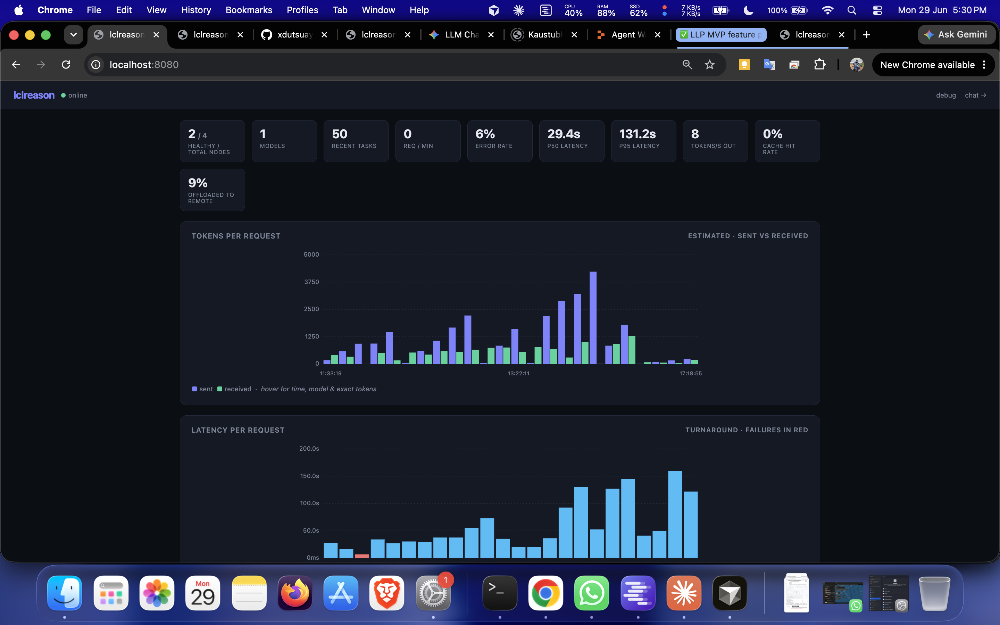
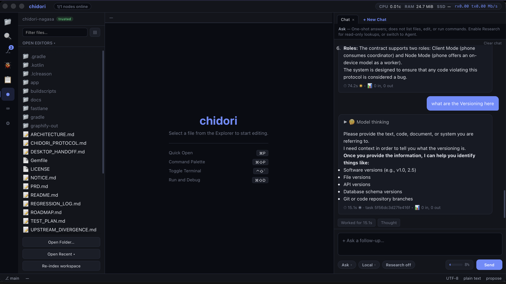
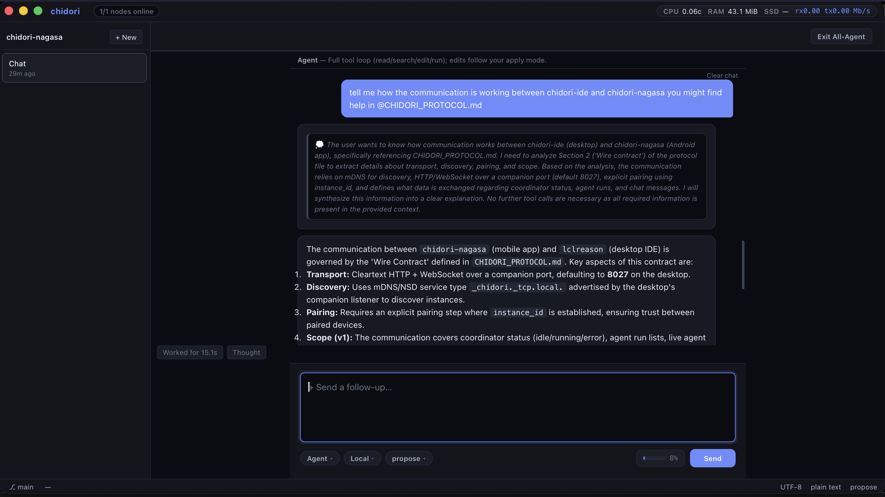
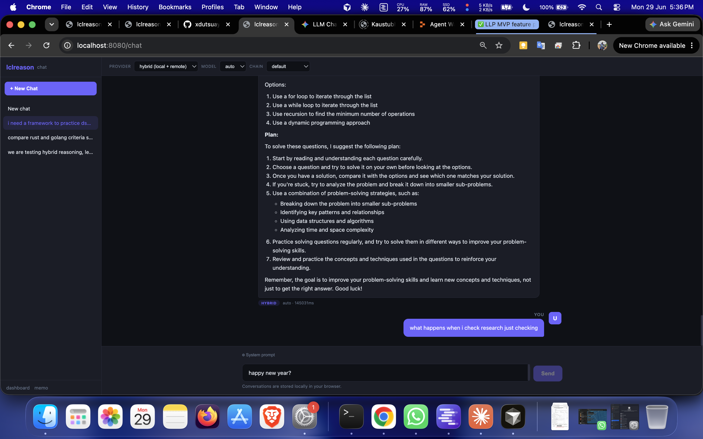
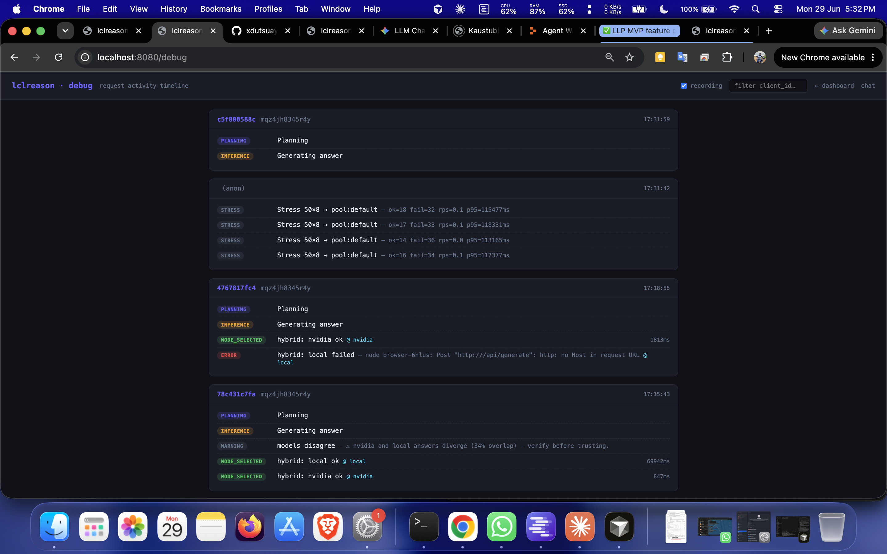
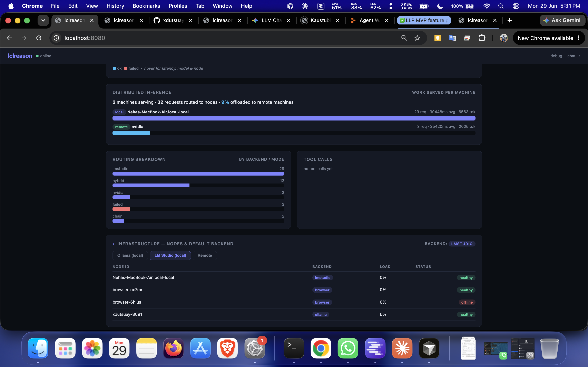

# chidori

<p align="center">
  
  
  
  
</p>

<p align="center">
  <strong>A native desktop IDE with a built-in reasoning engine.</strong><br/>
  Ask · Agent · Plan · Debug — local-first, hybrid-routed, no Electron.
</p>

<p align="center">
  <a href="https://github.com/xdutsuay/chidori/releases/tag/v0.5.0"><strong>⬇ Download v0.5.0</strong></a>
  &nbsp;·&nbsp;
  <a href="https://kaustubhtripathi.com/public/lab/lclreason/"><strong>Product page</strong></a>
</p>

> **Binaries only.** This repository hosts pre-built downloads, screenshots, and docs.
> **There is no source code here** — do not expect to clone and build.

**Latest public binary:** [v0.5.0](https://github.com/xdutsuay/chidori/releases/tag/v0.5.0) ·
Code freeze through **15 September 2026** · Next build expected early October.

---

## See it in action

Clips are hosted on the [v0.5.0 Release](https://github.com/xdutsuay/chidori/releases/tag/v0.5.0) (not committed into git).

<table>
  <tr>
    <td align="center" width="50%">
      <strong>Ask mode</strong> · ~3:54<br/>
      <video src="https://github.com/xdutsuay/chidori/releases/download/v0.5.0/ask-demo.mp4" controls playsinline preload="metadata" poster="docs/screenshots/askmode_modelthink_taskid.png" width="100%"></video><br/>
      <sub><a href="https://github.com/xdutsuay/chidori/releases/download/v0.5.0/ask-demo.mp4">Open / download</a></sub>
    </td>
    <td align="center" width="50%">
      <strong>UI highlight</strong> · 90s<br/>
      <video src="https://github.com/xdutsuay/chidori/releases/download/v0.5.0/ui-highlight.mp4" controls playsinline preload="metadata" poster="docs/screenshots/UPD.png" width="100%"></video><br/>
      <sub><a href="https://github.com/xdutsuay/chidori/releases/download/v0.5.0/ui-highlight.mp4">Open / download</a></sub>
    </td>
  </tr>
  <tr>
    <td align="center" colspan="2">
      <strong>Linux pass</strong> (optional) · ~59s — Ctrl+W closes tabs, app stays open<br/>
      <video src="https://github.com/xdutsuay/chidori/releases/download/v0.5.0/linux-pass.mp4" controls playsinline preload="metadata" poster="docs/screenshots/chat.png" width="640"></video><br/>
      <sub><a href="https://github.com/xdutsuay/chidori/releases/download/v0.5.0/linux-pass.mp4">Open / download</a> · not a public Linux zip claim</sub>
    </td>
  </tr>
</table>

> **Note:** GitHub’s README renderer is picky about `<video>`. If a player doesn’t appear in your viewer, use the Open / download links (they always work). Full notes: [docs/DEMO.md](docs/DEMO.md).

> Public desktop packages today are **macOS arm64** and **Windows x64**.
> Linux GUI is exercised in CI / dogfood; a public Linux zip is **not** part of v0.5.0.

---

## Built for how you work

| Ask | Agent | Plan | Debug |
|:---:|:-----:|:----:|:-----:|
| Direct Q&A with codebase context | Autonomous coding with tool loop & diffs | Architecture & investigation — proposes, doesn't auto-apply | Error diagnosis (pairs with Delve DAP for Go) |

All four share one inference coordinator and **local ↔ hybrid ↔ remote** routing.

---

## Screenshots

Real stills from a live session — also on the [product page](https://kaustubhtripathi.com/public/lab/lclreason/).

<table>
  <tr>
    <td align="center" width="33%">
      <br/>
      <sub>IDE overview</sub>
    </td>
    <td align="center" width="33%">
      <br/>
      <sub>Ask — thinking + task ID</sub>
    </td>
    <td align="center" width="33%">
      <br/>
      <sub>Agent / All-Agent layout</sub>
    </td>
  </tr>
  <tr>
    <td align="center" width="33%">
      <br/>
      <sub>Chat streaming</sub>
    </td>
    <td align="center" width="33%">
      <br/>
      <sub>Debug mode</sub>
    </td>
    <td align="center" width="33%">
      <br/>
      <sub>Distributed inference</sub>
    </td>
  </tr>
</table>

---

## Download v0.5.0

Pre-built binaries from [**Releases**](https://github.com/xdutsuay/chidori/releases):

| Platform | Artifact |
|:---------|:---------|
| **macOS** (Apple Silicon) | [`chidori-macos-arm64-v0.5.0.zip`](https://github.com/xdutsuay/chidori/releases/download/v0.5.0/chidori-macos-arm64-v0.5.0.zip) |
| **Windows** (x64) | [`chidori-windows-amd64-v0.5.0.zip`](https://github.com/xdutsuay/chidori/releases/download/v0.5.0/chidori-windows-amd64-v0.5.0.zip) |
| **Android companion** | APK from [`xdutsuay/chidori-nagasa`](https://github.com/xdutsuay/chidori-nagasa/releases) |

```bash
# macOS
curl -LO https://github.com/xdutsuay/chidori/releases/download/v0.5.0/chidori-macos-arm64-v0.5.0.zip
unzip chidori-macos-arm64-v0.5.0.zip

# Windows (PowerShell)
curl.exe -LO https://github.com/xdutsuay/chidori/releases/download/v0.5.0/chidori-windows-amd64-v0.5.0.zip
```

> **macOS Gatekeeper.** chidori is **not code-signed or notarized** in v0.5.0.
> On first launch, right-click `chidori.app` → **Open** → confirm **Open**.
> That is Gatekeeper's normal response to unsigned apps — not a malware scan.
> Signing / notarization are on the public roadmap (no date yet).

**Requirements:** macOS 10.10+ (Apple Silicon) · Windows 7+ x64 · optional [Ollama](https://ollama.com) / [LM Studio](https://lmstudio.ai) for local inference.

---

## What's new in v0.5.0

High-reliability desktop checkpoint — aligned with the [product page](https://kaustubhtripathi.com/public/lab/lclreason/):

- **Stop actually stops** — shared Ask/Agent/Plan/Debug deadlines; packaged Stop cancel
- **Oversize prompts fail loudly** — fail-closed context budget (HTTP 400 unless truncate)
- **Faster re-index after edits** — incremental workspace RAG
- **Broken tools error out** — Grok ACP + MCP fail-closed; Zen / secondary sidebar
- **Android companion APK** — LAN pair, monitor, remote chat ([chidori-nagasa](https://github.com/xdutsuay/chidori-nagasa))

| Status | Item |
|:-------|:-----|
| Shipped | Android companion APK |
| Next | CLI inside the packaged app (`chidori ask` on PATH) |
| Later | Signed / notarized macOS builds |

---

## Hybrid routing

Most AI coding tools force a choice: fully local or fully cloud. chidori treats
*where a request runs* as a routing decision.

```
chidori (native desktop IDE)
  │
  ├── Monaco editor  ──┬── gopls (Go intelligence)
  │                    └── Integrated terminal
  │
  └── Agent chat  ──►  Tool-calling agent loop
                          │
                          ▼
                       Dispatch
                    local ↔ hybrid ↔ remote
                    ┌─────┴─────┐
              Local nodes    Hosted providers
           Ollama / LM Studio   Anthropic / OpenAI /
           / AirLLM (LAN)       Groq / NIM / OpenRouter / …
```

- **Local** — this machine or a LAN node
- **Hybrid** — race local vs hosted; keep the first answer
- **Remote** — hosted key with zero local nodes

Configure in **Settings → Inference Source**.

---

## Companion

Pair an Android phone as companion or optional inference node.

| | |
|:--|:--|
| **APK** | Debug-signed sideload from [`chidori-nagasa` Releases](https://github.com/xdutsuay/chidori-nagasa/releases) (source public / MIT) |
| **Desktop** | Settings → Companion — listen on port **8027** |
| **Phone** | Settings → Chidori Desktop — mDNS discover or `host:8027` |
| **Capabilities** | Monitor runs · remote chat through desktop models · optional phone-as-node (on-device GGUF) |

---

## Getting started

1. **Download** [v0.5.0](https://github.com/xdutsuay/chidori/releases/tag/v0.5.0) for your platform.
2. **Launch** chidori → **File → Open Folder…** and pick a workspace.
3. **Configure inference** in **Settings → Inference Source** — attach Ollama/LM Studio (Scan LAN or IP), or add a hosted OpenAI-compatible API key.
4. **Start chatting** — pick Ask, Agent, Plan, or Debug. Use `@file`, `@folder`, or `@codebase` for workspace context.

<details>
<summary><strong>Optional: Go language features</strong></summary>

```bash
go install golang.org/x/tools/gopls@latest
```

Restart chidori. Go gets diagnostics, go-to-definition, rename, and quick fixes via gopls.
Other languages use Monaco's built-in editing.

</details>

<details>
<summary><strong>Optional: project rules & skills</strong></summary>

- Drop `.lclreason/rules.md` or `.cursorrules` in the project root — injected into every agent request.
- Define slash commands in **Settings → Commands**.
- After a useful run, **Save as Skill** to keep a per-workspace prompt template.

</details>

---

## Deep features

The README stays light. Full product inventory — editor, agent loop, LSP, workflows,
settings, packaging, and explicit non-goals — lives in **[docs/FEATURES.md](docs/FEATURES.md)**.

---

## Feedback

Bugs & ideas → [github.com/xdutsuay/chidori/issues](https://github.com/xdutsuay/chidori/issues)

Product site & changelog → [kaustubhtripathi.com/public/lab/lclreason/](https://kaustubhtripathi.com/public/lab/lclreason/)

Watch [Releases](https://github.com/xdutsuay/chidori/releases) for new binaries.

---

## License

Documentation in this repository is MIT-licensed (see [LICENSE](LICENSE)).

chidori is distributed as **pre-built binaries only**. **Source code is not published.**
